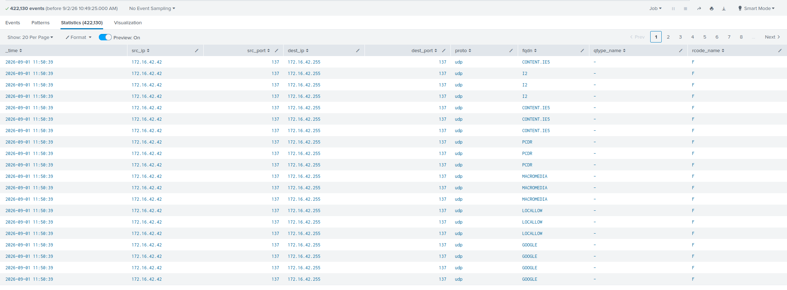
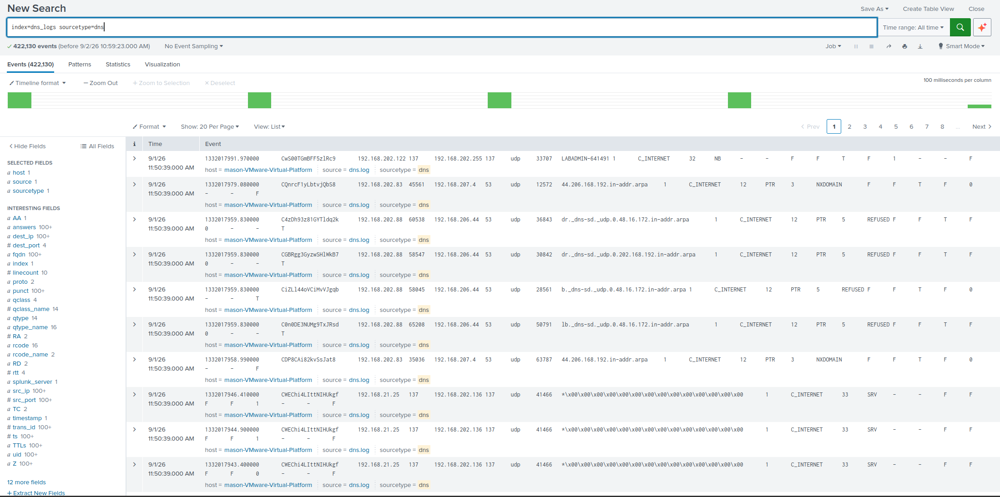
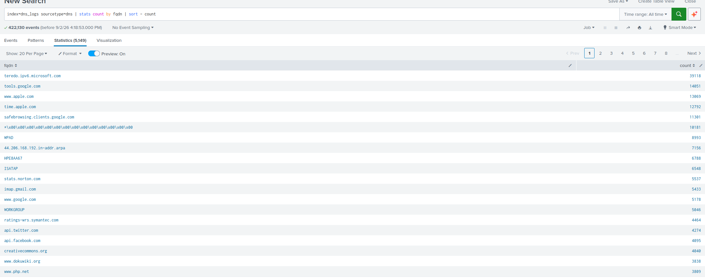
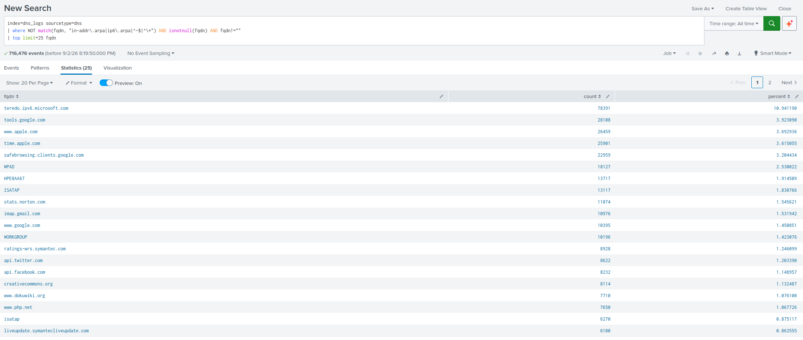
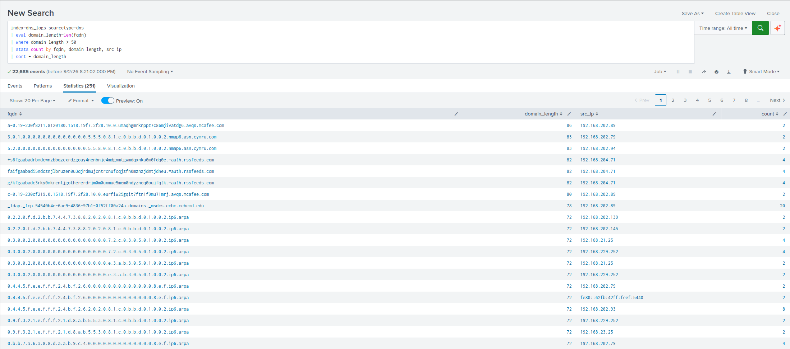

# DNS Log Analysis

**Objective:** Ingest DNS log into Splunk, extract usable fields, and hunt for evidence of reconnaissance, command-and-control, or data exfiltration over DNS (anything malicious).

**Dataset:** `dns.log` from the MACCDC 2012 capture
**Index:** `dns_logs`  |  **Sourcetype:** `dns`

---

## Why DNS?

DNS is one of the most under-monitored protocols on most networks. It is almost never blocked at the perimeter, which makes it attractive to attackers for two purposes:

- **Reconnaissance** — mapping internal hosts via reverse lookups before choosing targets
- **Covert channels** — encoding stolen data or C2 instructions into subdomain labels, where it leaves the network disguised as ordinary name resolution

Both showed up in this dataset. You can check the screenshots section to see all forms of malicious activity.

---

## Methodology

### 1. Ingestion

The log was uploaded to Splunk and personally assigned a sourcetype and index.

**Problem encountered:** Splunk indexed each line as a single unparsed blob. Every event showed only `_time` and `_raw`, so no field-based searching was possible.

**Root cause:** Zeek logs are tab-delimited with no header Splunk recognizes automatically.

**Fix:** Defined a search-time field extraction mapping the DNS schema to named fields by using the config files `transform.conf` and `props.conf`.

`transforms.conf`:
```ini
[zeek_dns_fields]
DELIMS = "	"
FIELDS = "ts","uid","src_ip","src_port","dest_ip","dest_port","proto","trans_id","fqdn","rtt","qclass","qclass_name","qtype","qtype_name","rcode","rcode_name","AA","TC","RD","RA","Z","answers","TTLs","rejected"
```

`props.conf`:
```ini
[dns]
SHOULD_LINEMERGE = false
LINE_BREAKER = ([\r\n]+)
TIME_PREFIX = ^
TIME_FORMAT = %s.%6N
MAX_TIMESTAMP_LOOKAHEAD = 25
REPORT-zeek_dns = zeek_dns_fields
```

📷 `screenshots/`[field-extracted.png](screenshots/field-extracted.png)

---

### 2. Baseline — all events

```spl
index=dns_logs sourcetype=dns
```

Time range set to **All time** (the dataset is from 2012; default ranges return nothing).

📷 `screenshots/`[all-events.png](screenshots/all-events.png)

---

### 3. Domain frequency analysis

```spl
index=dns_logs sourcetype=dns | stats count by fqdn | sort - count
```

The initial output was dominated by protocol noise, which had to be characterized before anything useful could be seen:

| Domain / Pattern | Count | Assessment |
|---|---|---|
| `*\x00\x00\x00...` | 10000+ | NetBIOS wildcard name queries (port 137) — Windows name resolution, not true DNS |
| `teredo.ipv6.microsoft.com` | 39000+ | Teredo IPv6 tunneling service — default Windows behavior, benign |
| `tools.google.com` | 14000+ | Google software update checks (Chrome, Earth, etc.) — benign |
| `www.apple.com` | 13000+ | Apple captive-portal / connectivity check — benign |
| `safebrowsing.clients.google.com` | | Chrome Safe Browsing blocklist updates — benign |
| `-` and `(empty)` | ~5,600 | Zeek null placeholders / response-only records |
| `*.in-addr.arpa` | 5000+ | Reverse DNS lookups — investigated separately, see Finding 2 |
| `0-jf-w.channel.facebook.com` | 1000+ | Facebook chat CDN — benign |

📷 `screenshots/`[stats-by-fqdn.png](screenshots/stats-by-fqdn.png)

---

### 4. Top domains and sources

```spl
index=dns_logs sourcetype=dns | top fqdn, src_ip
```

Pairing domain with source IP shows not just *what* was queried but *who* queried it — critical for spotting a single host driving anomalous volume rather than traffic distributed normally across the network.

To cut through the noise and see real domains:

```spl
index=dns_logs sourcetype=dns
| where NOT match(fqdn, "in-addr\.arpa|ip6\.arpa|^-$|^\*") AND isnotnull(fqdn) AND fqdn!=""
| top limit=25 fqdn
```

📷 `screenshots/`[top-fqdn-src.png](screenshots/top-fqdn-src.png)

---

### 5. Long domain check

Rather than searching for known-bad domains (which only finds what is already on a blocklist), this looks for the *structural characteristic* of tunneling — abnormally long domain names:

```spl
index=dns_logs sourcetype=dns
| eval domain_length=len(fqdn)
| where domain_length > 50
| stats count by fqdn, domain_length, src_ip
| sort - domain_length
```

📷 `screenshots/`[long-domains.png](screenshots/long-domains.png)

---

## Findings

### 🔴 Finding 1 — DNS tunneling / data exfiltration

**Source host:** `192.168.204.71`
**Destination domain:** `rssfeeds.com`

Observed queries:
```
+s4yj3z+ahnzaa.=connect.rssfeeds.com
+s6fgaabadrbmdcwnzbbqzcxrdzgouy4nenbnje4mdgxmtgwmdqxnku0m0fdq0e.=auth.rssfeeds.com
faifgaabadi5ndcznjlbruzen0u3qjrdmujcntrcnufcqjzfn0mznzjdmtjdneu.=auth.rssfeeds.com
g/kfgaabadc3rky0mkrcntjgothererdrjm0m0uxmue5mem0ndyzneq0oujfqtk.=auth.rssfeeds.com
```

**Why this is malicious:**

- The payload sits in the **subdomain label**, not the registered domain — the hallmark of a DNS covert channel. The attacker controls the authoritative nameserver for `rssfeeds.com` and reads the encoded data out of the query itself.
- The encoded labels are **~63 characters**, exactly the maximum length of a single DNS label. Tunneling tools pack labels to the limit to maximize throughput per query. This is a deliberate engineering choice, not random noise.
- The strings are high-entropy and base32-like — consistent with encoded binary data.
- The parent domain is chosen to look innocuous (an RSS feed service) to survive casual log review.
- **`192.168.204.71` was the only host in the dataset generating this traffic**, and it sits on a different subnet from the reconnaissance cluster in Finding 2.

**Recommended action:** Isolate the host, capture memory, identify the process making the queries, and block `rssfeeds.com` at the resolver. Review what data the host had access to.

---

### 🟠 Finding 2 — Network reconnaissance cluster

Two independent detection methods identified the same set of hosts, which is what elevates this from "unusual" to "confirmed."

**Method A — mass reverse-DNS enumeration**

```spl
index=dns_logs sourcetype=dns fqdn="*.in-addr.arpa"
| stats dc(fqdn) as unique_lookups by src_ip
| sort - unique_lookups
```

`dc()` (distinct count) is the right aggregation here rather than `count`. A host that queries one address ten thousand times is noisy; a host that queries ten thousand *different* addresses is mapping the network. Breadth is the signal, not volume.

| Source IP | Unique reverse lookups |
|---|---|
| 192.168.202.79 | 2,375 |
| 192.168.202.138 | 2,051 |
| 192.168.202.140 | 2,033 |
| 192.168.202.110 | 1,559 |
| 192.168.202.115 | 602 |
| 192.168.202.101 | 280 |
| 192.168.202.97 | 256 |

**Method B — scanner artifacts in DNS**

```spl
index=dns_logs sourcetype=dns fqdn="*nessus*"
| stats count by src_ip, fqdn
```

| Source IP | Domain | Count |
|---|---|---|
| 192.168.202.110 | `tested.by.nessus.org` | 19 |
| 192.168.202.110 | `ms11-058.t.nessus.org` | 14 |
| 192.168.202.110 | `../nessus` | 19 |
| 192.168.202.138 | `tested.by.nessus.org` | 3 |
| 192.168.202.140 | `../nessus` | 6 |

`tested.by.nessus.org` is Nessus verifying DNS resolution works. `ms11-058.t.nessus.org` is a check for MS11-058, a Windows DNS Server remote code execution vulnerability. The `../nessus` string is a path-traversal payload leaking into DNS logs from the scanner's web-application test module.

Additionally, `192.168.202.79` and `192.168.202.94` queried `nmap6.asn.cymru.com` — nmap's IPv6 ASN lookup feature, confirming **nmap** was also in use.

**The correlation:** hosts `.110`, `.138`, and `.140` appear at the top of *both* lists. Reverse-lookup enumeration and vulnerability-scanner traffic from the same hosts is a coherent reconnaissance phase, not coincidence.

---

### 🟢 Finding 3 — Anomalies investigated and ruled out

Not every long, random-looking domain is an attack. Two patterns matched the tunneling *signature* but were confirmed benign:

**`avqs.mcafee.com`**
```
a-0.19-230f8211.8120180.1518.19f7.2f28.10.0.umaqhgmrknppz7c86mjivatdg6.avqs.mcafee.com
c-0.19-230cf219.0.1518.19f7.2f28.10.0.eurfiw2igqit7ftn1f9mu71mrj.avqs.mcafee.com
```
McAfee antivirus encodes file and URL hashes into subdomain labels to query its cloud reputation service. Structurally identical technique to DNS tunneling — legitimate purpose. Source `192.168.202.89` is a protected endpoint, not a compromised one.

**Active Directory service discovery**
```
_ldap._tcp.54540b4e-6ae9-4836-97b1-0f52ff00a24a.domains._msdcs.ccbc.ccbcmd.edu
```
Standard Windows SRV record lookup for locating domain controllers. The GUID makes it long; it is entirely routine.

**Why this section exists:** flagging long domains is trivial to automate. Knowing which ones to dismiss — and being able to explain why — is the part that requires an analyst. Both of these would generate false positives in a naive entropy-based detection rule.

---

## Summary

| Finding | Host(s) | Severity |
|---|---|---|
| DNS tunneling to `rssfeeds.com` | 192.168.204.71 | High |
| Network recon via reverse DNS + Nessus/nmap | 192.168.202.79, .110, .138, .140 | Medium |
| McAfee reputation lookups | 192.168.202.89 | Benign |
| AD domain controller discovery | 192.168.202.89 | Benign |

A cluster of hosts on the `192.168.202.0/24` subnet conducted network reconnaissance through mass reverse-DNS enumeration and vulnerability scanning. Separately, a single host on `192.168.204.0/24` exhibited DNS tunneling behavior consistent with data exfiltration. Two additional high-entropy domain patterns were investigated and ruled out as benign vendor and Active Directory traffic.

---

## Lessons Learned

- **Field extraction is the real work.** Raw logs are useless until parsed. Understanding the Zeek schema and Splunk's `props.conf`/`transforms.conf` model was the largest time investment and the most transferable skill. It was very important to understanding the logs more and getting to the real meat of the lab.
- **Hunt for characteristics, not signatures.** Searching for known-bad domains only finds what is already blocked. Searching for *structural properties* — label length, entropy, lookup breadth — finds things no blocklist has yet.
- **Corroborate before concluding.** The recon finding is credible because two independent methods pointed at the same hosts.
- **Document the false positives.** They demonstrate judgment more clearly than the true positives do.
